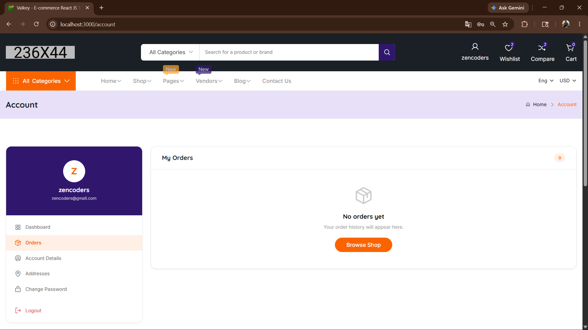
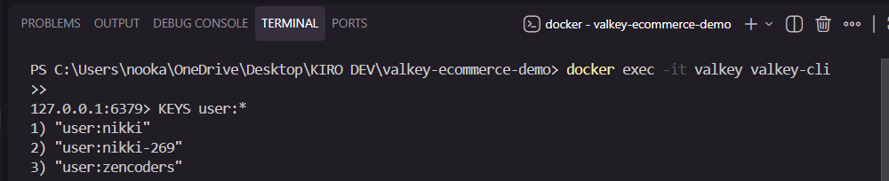
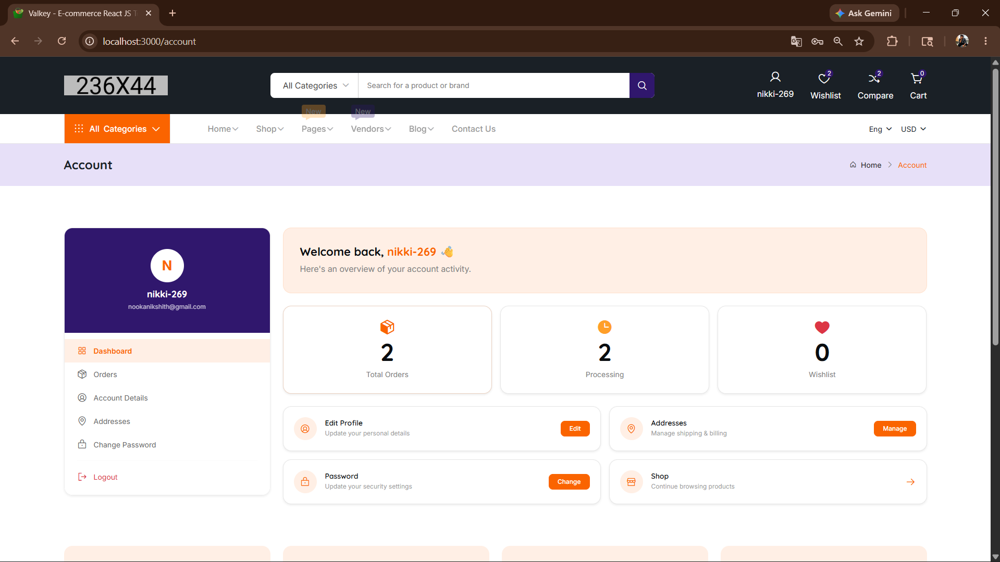
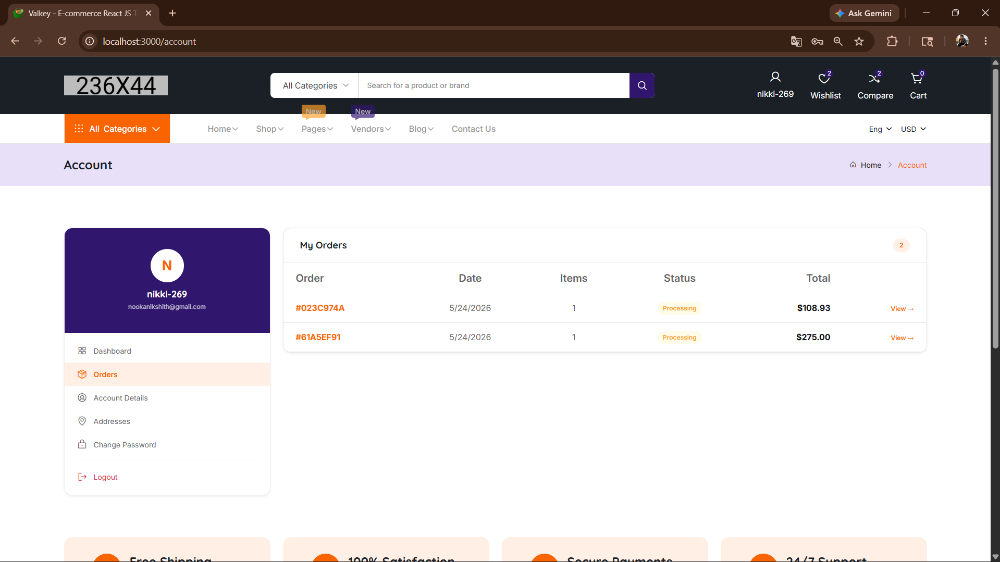
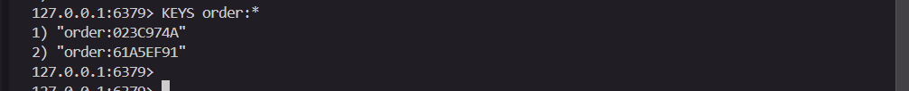
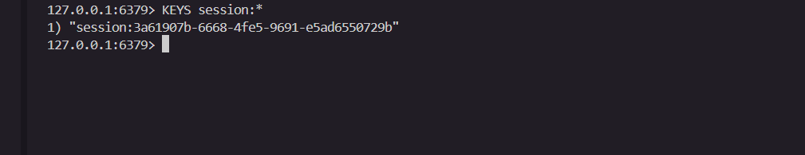
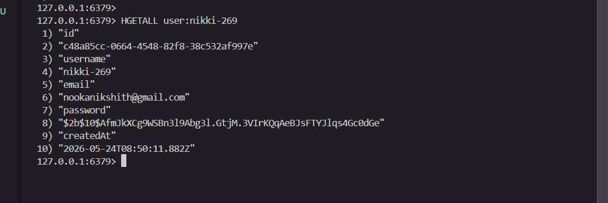

# 🚀 ZenCoders — Valkey E-Commerce Authentication & Checkout System

> **Team ZenCoders** | Build Beyond Limits Hackathon | Powered by Valkey × React Hyderabad

---

## 🎯 What We Built

We took the static e-commerce frontend and transformed it into a **fully functional application** with real-time user authentication, session management, shopping cart, and order processing — all powered by **Valkey** as the primary data store.

### Challenge Areas Implemented

| # | Challenge | Status |
|---|-----------|--------|
| 1 | **User Authentication** — Login, Registration, Session Management | ✅ Complete |
| 2 | **Checkout & Order Processing** — Full order lifecycle with inventory tracking | ✅ Complete |
| 3 | **Shopping Cart** — Real-time cart with persistent state | ✅ Complete |

---

## 🏗️ Architecture

```
┌─────────────────────┐     ┌─────────────────────┐     ┌─────────────────────┐
│                     │     │                     │     │                     │
│   React Frontend    │────▶│   Express Backend   │────▶│   Valkey (Docker)   │
│   localhost:3000    │     │   localhost:5000    │     │   localhost:6379    │
│                     │     │                     │     │                     │
└─────────────────────┘     └─────────────────────┘     └─────────────────────┘
        UI Layer                  API Layer                  Data Layer
```

---

## ⚡ Valkey Usage — How We Leverage Every Feature

### 1. User Storage (Hashes)
```
HSET user:nikki id username email password firstName lastName phone billingAddress shippingAddress
```
Each user is a Valkey Hash — O(1) field access, no schema overhead.

### 2. Session Management (Strings + TTL)
```
SET session:<uuid-token> '{"userId":"...","username":"nikki"}' EX 604800
```
Sessions auto-expire in 7 days. Logout = instant `DEL`. No database cleanup needed.

### 3. Email-to-Username Mapping (Strings)
```
SET email:user@example.com "nikki"
```
Enables login by email OR username with a single key lookup.

### 4. Order Storage (Hashes)
```
HSET order:A3F2B1C9 id items shippingAddress total status createdAt
```
Each order is a self-contained hash with JSON-serialized items.

### 5. User Order History (Sorted Sets)
```
ZADD orders:nikki <timestamp> "A3F2B1C9"
```
Orders sorted by recency. `ZREVRANGE` gives latest-first pagination for free.

### 6. Inventory Tracking (Strings)
```
DECR inventory:prod-chromebook-001
```
Atomic decrement on purchase — no race conditions.

---

## 🔥 Features Implemented

### Authentication System
- ✅ User registration with bcrypt password hashing
- ✅ Login via username OR email
- ✅ Token-based session management (UUID tokens stored in Valkey)
- ✅ Auto-session restoration on page reload
- ✅ Secure logout (server-side session invalidation)
- ✅ Password change with current password verification
- ✅ Profile update (name, phone, display name)
- ✅ Address management (billing + shipping)
- ✅ Auth-gated routes (cart requires login)

### Shopping Cart
- ✅ Add to cart from any product listing (shop, vendors, homepage)
- ✅ Smart product extraction (name, price, image from DOM)
- ✅ Quantity controls (+/-)
- ✅ Remove items
- ✅ Persistent cart (survives page refresh via localStorage)
- ✅ Real-time cart badge in header
- ✅ Toast notifications on add ("Added to cart!")
- ✅ Auth gate — redirects to login if not authenticated

### Checkout & Orders
- ✅ Full checkout form (shipping address, payment method)
- ✅ Order placement with Valkey persistence
- ✅ Automatic tax calculation (10%)
- ✅ Free shipping over $100
- ✅ Order history in account dashboard
- ✅ Order detail view (items, address, summary)
- ✅ Status tracking (Processing → Shipped → Delivered)
- ✅ Inventory decrement on purchase

### Account Dashboard
- ✅ Clean sidebar navigation with active states
- ✅ Dashboard overview with live order stats
- ✅ Orders tab with table + detail view
- ✅ Profile editing tab
- ✅ Address management (billing/shipping)
- ✅ Password change tab
- ✅ Responsive design matching app theme

---

## 🛠️ Tech Stack

| Layer | Technology |
|-------|-----------|
| Frontend | React 18, React Router v6, Bootstrap 5, Phosphor Icons |
| Backend | Node.js, Express.js |
| Database | **Valkey** (Redis-compatible, all modules) |
| Auth | bcrypt + UUID session tokens |
| Container | Docker (valkey-bundle:9-alpine) |
| State | React Context API + localStorage |

---

## 📁 Files Added/Modified

### New — Backend (`/backend`)
```
backend/
├── server.js              # Express server entry point
├── package.json           # Dependencies
├── config/
│   └── valkey.js          # Valkey connection (ioredis)
├── middleware/
│   └── auth.js            # Token validation middleware
└── routes/
    ├── auth.js            # Register, Login, Logout, Profile, Password
    └── orders.js          # Place order, Get orders, Get order by ID
```

### New — Frontend
```
frontend/src/
├── context/
│   ├── AuthContext.js     # Auth state management
│   └── CartContext.js     # Cart state management
├── services/
│   ├── authAPI.js         # Auth API calls
│   └── ordersAPI.js       # Orders API calls
├── helper/
│   └── CartInterceptor.js # Global add-to-cart handler
└── components/
    └── AccountDashboard.jsx  # Full account dashboard
```

### Modified — Frontend
```
frontend/src/
├── App.js                 # Added CartInterceptor
├── index.js               # Wrapped with AuthProvider + CartProvider
├── index.scss             # Added toast animation
└── components/
    ├── Account.jsx        # Wired login/register forms
    ├── CartSection.jsx    # Dynamic cart from context
    ├── Checkout.jsx       # Real checkout with order placement
    ├── HeaderTwo.jsx      # Auth-aware (username + cart count)
    └── ProductDetailsOne.jsx  # Working Add to Cart button
```

---

## 🚀 How to Run

```bash
# 1. Start Valkey
docker run -d --name valkey -p 6379:6379 valkey/valkey-bundle:9-alpine

# 2. Start Backend
cd backend
npm install
npm start

# 3. Start Frontend
cd frontend
npm install
npm start
```

Open http://localhost:3000 → Register → Shop → Add to Cart → Checkout → View Orders 🎉

---

## 👥 Team ZenCoders

| Member | Role |
|--------|------|
| Nooka Nikshith | Full-Stack Developer & Team Lead |
| Namburi Rishika | Frontend Developer |
| Pacha Likhitha Sai | Backend Developer |
| Rajkamal Pathgani | Database & DevOps |

**University:** Malla Reddy University  
**Email:** 2311cs020483@mallareddyuniversity.ac.in  
**GitHub:** [@nikki-nooka](https://github.com/nikki-nooka)

---

---

## 📸 Proof of Work

### Account Dashboard


### User Accounts in Valkey


### Dashboard — Logged In User


### Orders via Dashboard


### Order Data in Valkey


### Active Sessions in Valkey


### User-Specific Data in Valkey


---

## 📜 License

MIT — Built for the Build Beyond Limits Hackathon powered by Valkey.
