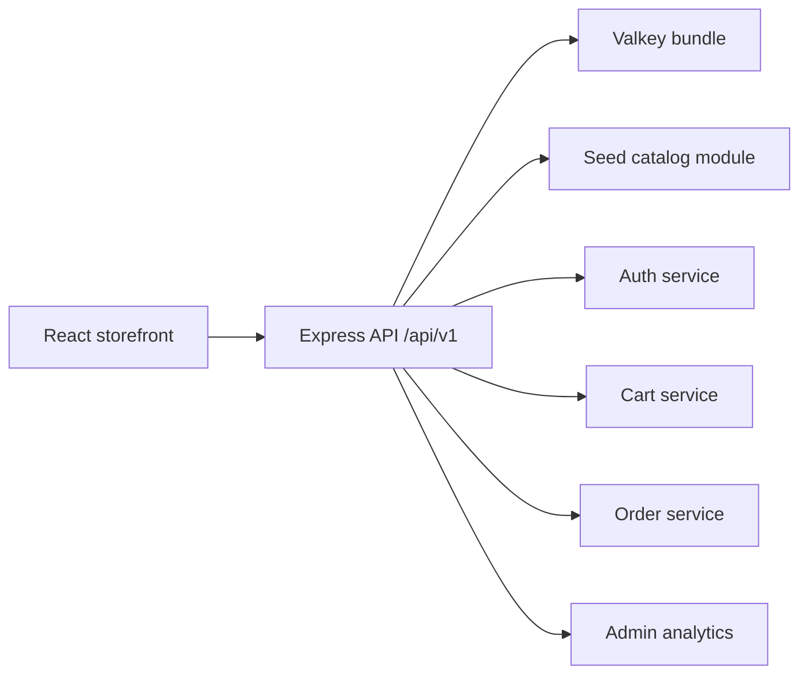

# Architecture Overview

## Current Architecture

## Frontend

- `frontend/src/commerce/CommerceApp.jsx`: route shell that preserves legacy URLs while loading modern commerce pages.
- `frontend/src/commerce/pages`: route-level screens for home, shop, product details, cart, checkout, account, wishlist, admin, and preserved content routes.
- `frontend/src/commerce/components`: reusable product cards, galleries, skeletons, empty states, forms, and route scroll behavior.
- `frontend/src/commerce/layout`: header and footer navigation shared across the storefront.
- `frontend/src/commerce/utils` and `frontend/src/commerce/config`: shared formatting, image fallback handling, and brand configuration.
- `frontend/src/commerce/CommerceContext.jsx`: auth, cart, wishlist, checkout, toasts, and API state.
- `frontend/src/commerce/api.js`: API client with session id, auth token, and JSON error handling.
- `frontend/src/commerce/commerce.css`: responsive UI system.
- `frontend/public/assets/images/commerce`: local catalog render assets; each product has studio, angle, and lifestyle images for cards, hover states, and galleries.

## Backend

- `backend/src/app.js`: Express app, security middleware, CORS, rate limiting, versioned API mount.
- `backend/src/server.js`: Valkey connection, auth bootstrap, graceful shutdown.
- `backend/src/routes`: versioned route modules.
- `backend/src/services`: product, cart, auth, wishlist, order, and Valkey services.
- `backend/src/validators`: Zod request schemas.
- `backend/src/data/catalog.js`: seed products, categories, coupons, reviews, gallery references, variants, stock, brand, pricing, and merchandising metadata.

## Valkey Usage

- Product list cache: `cache:products:*`
- Product details cache: `cache:product:{id}`
- Cart cache: `cart:{identity}`
- Wishlist cache: `wishlist:{identity}`
- Sessions: `session:{jti}`
- Rate limiting: `rate:{ip}:{window}`
- Hot products: `analytics:hot-products` sorted set
- Recently viewed: `recently-viewed:{identity}`
- Orders: `order:{id}` and `orders:{identity}`

## Security

- Helmet secure headers.
- CORS allow-list with local development support.
- Zod validation for route inputs.
- XSS string sanitization.
- Mongo operator sanitization.
- bcrypt password hashing.
- JWT sessions with Valkey-backed revocation.
- RBAC middleware for admin routes.
- Valkey-backed rate limiting.

## Known Design Decisions

- Seed data is intentionally local so the project runs immediately.
- Valkey has a development fallback for local resilience.
- `VALKEY_REQUIRED=true` should be used in production.
- Frontend consumes the API through `VITE_API_URL`.
