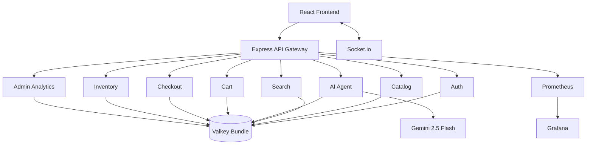

# ShopMind AI

ShopMind AI transforms the original Valkey E-Commerce Demo into an AI commerce platform with a React storefront, Node/Express backend, Socket.io realtime layer, Valkey Bundle data platform, Prometheus, and Grafana.

## Run

```bash
docker compose up --build
```

Then open:

- Storefront: http://localhost:3000
- API health: http://localhost:4000/health
- Swagger: http://localhost:4000/api/docs
- Prometheus: http://localhost:9090
- Grafana: http://localhost:3001, admin/shopmind

Gemini is optional. Set `GEMINI_API_KEY` for live Gemini 2.5 Flash reasoning. Without it, deterministic demo AI keeps every flow runnable.

## Demo Accounts

- Admin: `admin@shopmind.ai` / `ShopMind@123`
- Shopper: `demo@shopmind.ai` / `ShopMind@123`

## Architecture



## Valkey Usage

| Capability | Where |
| --- | --- |
| JSON | products, users, carts, orders, inventory, coupons |
| Search | keyword/category/brand product search indexes |
| Vector Search | deterministic embeddings and semantic similarity |
| Pub/Sub | inventory, notifications, trending, order tracking |
| Streams | checkout, inventory, analytics event logs |
| Sorted Sets | trending products and personalization scores |
| GEO | live driver location and ETA demo |
| Caching | AI response cache with TTL |
| Sessions | login sessions with TTL |
| Rate Limiting | login, search, chat, autocomplete |

## Feature Tour

1. Open `/` and inspect the ShopMind strip with live trending products.
2. Open `/ai-search` and ask: `I need a laptop for AI development under ₹80,000`.
3. Open `/assistant` for persistent shopping advice and product comparison.
4. Add products through API or cart routes and complete checkout to create Stream-backed orders.
5. Open `/orders` for delivery tracking powered by Valkey GEO.
6. Open `/admin` for analytics, AI insights, and Grafana entry point.

## API Highlights

- `POST /api/ai/search`
- `POST /api/ai/chat`
- `GET /api/search`
- `POST /api/search/semantic`
- `GET /api/products/:id/similar`
- `POST /api/cart/items`
- `POST /api/checkout/reserve`
- `POST /api/checkout/orders`
- `GET /api/trending`
- `GET /api/admin/analytics/overview`

Full OpenAPI docs are available at `/api/docs`.

## Deployment Notes

- Vercel: deploy `frontend`, set `REACT_APP_API_URL`.
- Railway/Render: deploy `backend`, attach Valkey-compatible service.
- AWS: run the compose stack on ECS or split frontend to S3/CloudFront, backend to ECS, Valkey to ElastiCache-compatible Valkey.

## Hackathon Notes

ShopMind AI visibly demonstrates the full Valkey surface area through major customer journeys: agentic search, vector recommendations, realtime inventory, smart cart, checkout streams, delivery GEO, notifications, rate limiting, sessions, caching, analytics, and admin observability.
